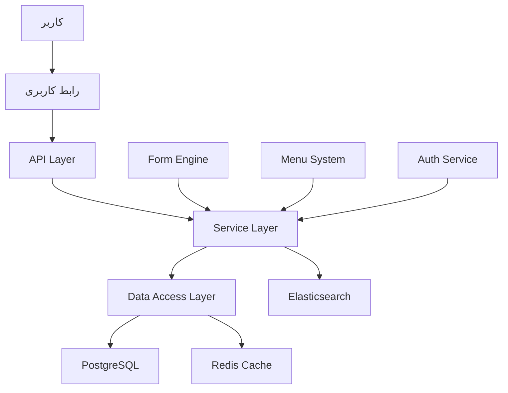

# معماری سیستم

## معرفی
این سند معماری کلی سیستم فرم‌ساز پویا را توصیف می‌کند. هدف اصلی، ایجاد یک پلتفرم انعطاف‌پذیر است که امکان ساخت و مدیریت فرم‌ها، منوها و ارتباطات بین آنها را به صورت پویا فراهم می‌کند.

## اصول معماری
1. **مقیاس‌پذیری**: طراحی برای رشد و توسعه آسان
2. **انعطاف‌پذیری**: قابلیت تطبیق با نیازهای مختلف
3. **قابلیت توسعه**: معماری ماژولار و قابل گسترش
4. **امنیت**: امنیت در تمام لایه‌ها
5. **عملکرد**: بهینه‌سازی برای سرعت و کارایی

## لایه‌های معماری

### 1. لایه پایگاه داده
#### PostgreSQL
- ذخیره‌سازی اصلی داده‌ها
- مدیریت روابط پیچیده
- پشتیبانی از JSON برای داده‌های پویا

#### Redis
- کش‌گذاری
- مدیریت نشست‌ها
- صف‌های پردازش

#### Elasticsearch
- جستجوی پیشرفته
- تحلیل لاگ‌ها
- گزارش‌گیری سریع

### 2. لایه سرور
#### Node.js با Express
- API RESTful
- میان‌افزارهای امنیتی
- مدیریت درخواست‌ها

#### GraphQL
- API انعطاف‌پذیر
- بهینه‌سازی درخواست‌ها
- Schema-driven development

#### سرویس‌های پایه
- احراز هویت و مجوزدهی
- مدیریت فایل‌ها
- پردازش پس‌زمینه

### 3. لایه کلاینت
#### React با TypeScript
- کامپوننت‌های قابل استفاده مجدد
- Type safety
- معماری مبتنی بر کامپوننت

#### مدیریت State
- React Query برای مدیریت داده‌ها
- Context API برای state عمومی
- Redux برای state پیچیده

#### رابط کاربری
- Material-UI برای طراحی
- Responsive design
- Accessibility

## معماری فرم‌ساز

### 1. موتور فرم‌ساز
```typescript
interface FormEngine {
  // مدیریت فرم
  createForm(definition: FormDefinition): Form;
  updateForm(id: string, updates: Partial<FormDefinition>): Form;
  
  // مدیریت فیلدها
  addField(formId: string, field: FieldDefinition): Field;
  updateField(fieldId: string, updates: Partial<FieldDefinition>): Field;
  
  // اعتبارسنجی
  validateForm(formId: string, data: any): ValidationResult;
  validateField(fieldId: string, value: any): ValidationResult;
  
  // روابط
  createRelation(source: string, target: string, type: RelationType): Relation;
  resolveRelations(formId: string): ResolvedRelations;
}
```

### 2. سیستم منو
```typescript
interface MenuSystem {
  // مدیریت منو
  createMenu(definition: MenuDefinition): Menu;
  updateMenu(id: string, updates: Partial<MenuDefinition>): Menu;
  
  // ساختار درختی
  addChild(parentId: string, child: MenuDefinition): Menu;
  moveMenuItem(id: string, newParentId: string): Menu;
  
  // دسترسی‌ها
  setPermissions(id: string, permissions: Permission[]): void;
  checkAccess(userId: string, menuId: string): boolean;
}
```

## جریان داده



## مدیریت امنیت

### 1. لایه‌های امنیتی
- احراز هویت JWT
- RBAC (Role-Based Access Control)
- امنیت در سطح API
- امنیت در سطح فیلد

### 2. کنترل دسترسی
```typescript
interface AccessControl {
  // سطوح دسترسی
  checkPermission(userId: string, resource: string, action: string): boolean;
  
  // نقش‌ها
  assignRole(userId: string, role: string): void;
  removeRole(userId: string, role: string): void;
  
  // مجوزها
  grantPermission(roleId: string, permission: Permission): void;
  revokePermission(roleId: string, permission: Permission): void;
}
```

## استراتژی کش‌گذاری

### 1. کش چند سطحی
- کش برنامه
- کش Redis
- کش مرورگر

### 2. استراتژی‌های کش
```typescript
interface CacheStrategy {
  // مدیریت کش
  set(key: string, value: any, ttl?: number): void;
  get(key: string): Promise<any>;
  invalidate(pattern: string): void;
  
  // کش هوشمند
  preload(patterns: string[]): void;
  warmup(key: string): void;
}
```

## مقیاس‌پذیری

### 1. افقی
- Load balancing
- Stateless services
- Distributed caching

### 2. عمودی
- Database optimization
- Query optimization
- Resource management

## نظارت و لاگ

### 1. سیستم لاگ
- Application logs
- Access logs
- Error tracking

### 2. متریک‌ها
- Performance metrics
- Business metrics
- System health

## چک‌لیست پیاده‌سازی

### فاز 1: زیرساخت
- [ ] راه‌اندازی پایگاه داده
- [ ] پیکربندی Redis
- [ ] نصب Elasticsearch
- [ ] تنظیم CI/CD

### فاز 2: هسته اصلی
- [ ] پیاده‌سازی API پایه
- [ ] سیستم احراز هویت
- [ ] مدیریت دسترسی‌ها
- [ ] سیستم لاگ

### فاز 3: موتور فرم‌ساز
- [ ] پیاده‌سازی موتور اصلی
- [ ] سیستم اعتبارسنجی
- [ ] مدیریت روابط
- [ ] رابط کاربری فرم‌ساز

### فاز 4: سیستم منو
- [ ] ساختار درختی منو
- [ ] مدیریت دسترسی‌ها
- [ ] یکپارچه‌سازی با فرم‌ساز
- [ ] رابط کاربری مدیریت منو 