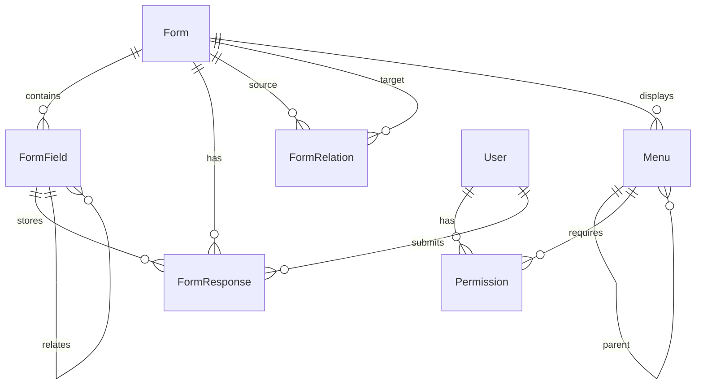

# ساختار پایگاه داده

## معرفی
این سند ساختار پایگاه داده سیستم را توصیف می‌کند. پایگاه داده اصلی PostgreSQL است که با Redis برای کش و Elasticsearch برای جستجو تکمیل می‌شود.

## دیاگرام ERD



## جداول اصلی

### 1. فرم‌ها (forms)
```sql
CREATE TABLE forms (
    id            UUID PRIMARY KEY DEFAULT uuid_generate_v4(),
    name          VARCHAR(255) NOT NULL,
    description   TEXT,
    fields        JSONB,        -- تنظیمات کلی فیلدها
    settings      JSONB,        -- تنظیمات عمومی
    styling       JSONB,        -- تنظیمات ظاهری
    metadata      JSONB,        -- متادیتا
    status        VARCHAR(50),  -- وضعیت فرم
    version       INTEGER,      -- نسخه
    created_by    UUID,         -- ایجاد کننده
    updated_by    UUID,         -- آخرین ویرایش کننده
    created_at    TIMESTAMP WITH TIME ZONE DEFAULT CURRENT_TIMESTAMP,
    updated_at    TIMESTAMP WITH TIME ZONE DEFAULT CURRENT_TIMESTAMP,
    
    FOREIGN KEY (created_by) REFERENCES users(id),
    FOREIGN KEY (updated_by) REFERENCES users(id)
);

CREATE INDEX idx_forms_status ON forms(status);
CREATE INDEX idx_forms_created_at ON forms(created_at);
CREATE INDEX idx_forms_metadata ON forms USING gin(metadata);
```

### 2. فیلدها (form_fields)
```sql
CREATE TABLE form_fields (
    id              UUID PRIMARY KEY DEFAULT uuid_generate_v4(),
    form_id         UUID NOT NULL,
    label           VARCHAR(255) NOT NULL,
    type            VARCHAR(50) NOT NULL,
    required        BOOLEAN DEFAULT false,
    order_index     INTEGER,
    config          JSONB,         -- تنظیمات خاص فیلد
    validation      JSONB,         -- قوانین اعتبارسنجی
    permissions     TEXT[],        -- دسترسی‌ها
    related_form_id UUID,          -- برای فیلدهای رابطه‌ای
    
    FOREIGN KEY (form_id) REFERENCES forms(id) ON DELETE CASCADE,
    FOREIGN KEY (related_form_id) REFERENCES forms(id)
);

CREATE INDEX idx_form_fields_form ON form_fields(form_id);
CREATE INDEX idx_form_fields_type ON form_fields(type);
```

### 3. روابط فرم‌ها (form_relations)
```sql
CREATE TABLE form_relations (
    id              UUID PRIMARY KEY DEFAULT uuid_generate_v4(),
    source_form_id  UUID NOT NULL,
    target_form_id  UUID NOT NULL,
    type            VARCHAR(50),     -- نوع رابطه
    config          JSONB,           -- تنظیمات رابطه
    
    FOREIGN KEY (source_form_id) REFERENCES forms(id) ON DELETE CASCADE,
    FOREIGN KEY (target_form_id) REFERENCES forms(id) ON DELETE CASCADE,
    
    UNIQUE (source_form_id, target_form_id)
);

CREATE INDEX idx_form_relations_source ON form_relations(source_form_id);
CREATE INDEX idx_form_relations_target ON form_relations(target_form_id);
```

### 4. پاسخ‌های فرم (form_responses)
```sql
CREATE TABLE form_responses (
    id              UUID PRIMARY KEY DEFAULT uuid_generate_v4(),
    form_id         UUID NOT NULL,
    data            JSONB NOT NULL,  -- داده‌های پاسخ
    metadata        JSONB,           -- متادیتا
    status          VARCHAR(50),     -- وضعیت پاسخ
    submitted_by    UUID,            -- ارسال کننده
    submitted_at    TIMESTAMP WITH TIME ZONE DEFAULT CURRENT_TIMESTAMP,
    
    FOREIGN KEY (form_id) REFERENCES forms(id) ON DELETE CASCADE,
    FOREIGN KEY (submitted_by) REFERENCES users(id)
);

CREATE INDEX idx_form_responses_form ON form_responses(form_id);
CREATE INDEX idx_form_responses_submitted_at ON form_responses(submitted_at);
CREATE INDEX idx_form_responses_data ON form_responses USING gin(data);
```

### 5. منوها (menus)
```sql
CREATE TABLE menus (
    id              UUID PRIMARY KEY DEFAULT uuid_generate_v4(),
    title           VARCHAR(255) NOT NULL,
    icon            VARCHAR(100),
    order_index     INTEGER DEFAULT 0,
    type            VARCHAR(50) NOT NULL,
    status          VARCHAR(50) DEFAULT 'active',
    config          JSONB,           -- تنظیمات منو
    parent_id       UUID,            -- منوی والد
    form_id         UUID,            -- فرم مرتبط
    permissions     TEXT[],          -- دسترسی‌ها
    roles           TEXT[],          -- نقش‌ها
    created_by      UUID,
    updated_by      UUID,
    created_at      TIMESTAMP WITH TIME ZONE DEFAULT CURRENT_TIMESTAMP,
    updated_at      TIMESTAMP WITH TIME ZONE DEFAULT CURRENT_TIMESTAMP,
    
    FOREIGN KEY (parent_id) REFERENCES menus(id),
    FOREIGN KEY (form_id) REFERENCES forms(id),
    FOREIGN KEY (created_by) REFERENCES users(id),
    FOREIGN KEY (updated_by) REFERENCES users(id)
);

CREATE INDEX idx_menus_parent ON menus(parent_id);
CREATE INDEX idx_menus_form ON menus(form_id);
CREATE INDEX idx_menus_type ON menus(type);
CREATE INDEX idx_menus_status ON menus(status);
```

## ساختارهای کمکی

### 1. قالب‌های فرم (form_templates)
```sql
CREATE TABLE form_templates (
    id              UUID PRIMARY KEY DEFAULT uuid_generate_v4(),
    name            VARCHAR(255) NOT NULL,
    description     TEXT,
    category        VARCHAR(100),
    content         JSONB NOT NULL,    -- ساختار فرم
    preview         TEXT,              -- URL پیش‌نمایش
    tags            TEXT[],
    popularity      INTEGER DEFAULT 0,
    is_active       BOOLEAN DEFAULT true,
    created_at      TIMESTAMP WITH TIME ZONE DEFAULT CURRENT_TIMESTAMP,
    updated_at      TIMESTAMP WITH TIME ZONE DEFAULT CURRENT_TIMESTAMP
);

CREATE INDEX idx_form_templates_category ON form_templates(category);
CREATE INDEX idx_form_templates_popularity ON form_templates(popularity);
```

### 2. تاریخچه تغییرات (form_history)
```sql
CREATE TABLE form_history (
    id              UUID PRIMARY KEY DEFAULT uuid_generate_v4(),
    form_id         UUID NOT NULL,
    version         INTEGER NOT NULL,
    changes         JSONB NOT NULL,     -- تغییرات
    changed_by      UUID NOT NULL,
    changed_at      TIMESTAMP WITH TIME ZONE DEFAULT CURRENT_TIMESTAMP,
    
    FOREIGN KEY (form_id) REFERENCES forms(id) ON DELETE CASCADE,
    FOREIGN KEY (changed_by) REFERENCES users(id)
);

CREATE INDEX idx_form_history_form ON form_history(form_id);
CREATE INDEX idx_form_history_version ON form_history(version);
```

## استراتژی‌های ذخیره‌سازی

### 1. داده‌های JSON
- استفاده از JSONB برای انعطاف‌پذیری
- ایندکس‌گذاری مناسب برای جستجو
- نرمال‌سازی داده‌های پرکاربرد

### 2. کش‌گذاری با Redis
```typescript
interface CacheStrategy {
  // کش فرم‌ها
  forms: {
    ttl: 3600,          // یک ساعت
    pattern: 'form:*'
  },
  
  // کش منوها
  menus: {
    ttl: 1800,          // 30 دقیقه
    pattern: 'menu:*'
  },
  
  // کش پاسخ‌ها
  responses: {
    ttl: 300,           // 5 دقیقه
    pattern: 'response:*'
  }
}
```

### 3. جستجو با Elasticsearch
```typescript
interface SearchIndexes {
  // ایندکس فرم‌ها
  forms: {
    settings: {
      number_of_shards: 1,
      number_of_replicas: 1
    },
    mappings: {
      properties: {
        name: { type: 'text' },
        description: { type: 'text' },
        fields: { type: 'nested' },
        metadata: { type: 'object' }
      }
    }
  },
  
  // ایندکس پاسخ‌ها
  responses: {
    settings: {
      number_of_shards: 2,
      number_of_replicas: 1
    },
    mappings: {
      properties: {
        form_id: { type: 'keyword' },
        data: { type: 'object' },
        submitted_at: { type: 'date' }
      }
    }
  }
}
```

## مدیریت تراکنش‌ها

### 1. تراکنش‌های پیچیده
```sql
BEGIN;

-- ایجاد فرم
INSERT INTO forms (...) VALUES (...) RETURNING id;

-- ایجاد فیلدها
INSERT INTO form_fields (...) VALUES (...);

-- ایجاد روابط
INSERT INTO form_relations (...) VALUES (...);

-- ثبت در تاریخچه
INSERT INTO form_history (...) VALUES (...);

COMMIT;
```

### 2. قفل‌گذاری
```sql
-- قفل برای ویرایش همزمان
SELECT * FROM forms WHERE id = :id FOR UPDATE;

-- قفل برای خواندن سازگار
SELECT * FROM forms WHERE id = :id FOR SHARE;
```

## نگهداری و بهینه‌سازی

### 1. ایندکس‌ها
```sql
-- ایندکس‌های ترکیبی
CREATE INDEX idx_forms_status_created_at ON forms(status, created_at);
CREATE INDEX idx_responses_form_date ON form_responses(form_id, submitted_at);

-- ایندکس‌های جزئی
CREATE INDEX idx_active_forms ON forms(id) WHERE status = 'active';
CREATE INDEX idx_recent_responses ON form_responses(id) 
WHERE submitted_at > CURRENT_DATE - INTERVAL '30 days';
```

### 2. پاکسازی
```sql
-- پاکسازی پاسخ‌های قدیمی
DELETE FROM form_responses 
WHERE status = 'draft' 
AND submitted_at < CURRENT_TIMESTAMP - INTERVAL '30 days';

-- آرشیو کردن
INSERT INTO form_responses_archive 
SELECT * FROM form_responses 
WHERE submitted_at < CURRENT_TIMESTAMP - INTERVAL '1 year';
```

### 3. بهینه‌سازی
```sql
-- آنالیز جداول
ANALYZE forms;
ANALYZE form_fields;
ANALYZE form_responses;

-- بازسازی ایندکس‌ها
REINDEX TABLE forms;
REINDEX TABLE form_responses;
```

## چک‌لیست پیاده‌سازی

### فاز 1: ساختار پایه
- [ ] ایجاد جداول اصلی
- [ ] تنظیم ایندکس‌ها
- [ ] پیاده‌سازی تریگرها
- [ ] تنظیم دسترسی‌ها

### فاز 2: لایه میانی
- [ ] پیاده‌سازی Repository
- [ ] مدیریت تراکنش‌ها
- [ ] کش‌گذاری
- [ ] لاگینگ

### فاز 3: جستجو و گزارش‌گیری
- [ ] راه‌اندازی Elasticsearch
- [ ] همگام‌سازی داده‌ها
- [ ] ایجاد گزارشات پایه
- [ ] بهینه‌سازی کوئری‌ها

### فاز 4: نگهداری
- [ ] پاکسازی خودکار
- [ ] پشتیبان‌گیری
- [ ] مانیتورینگ
- [ ] بهینه‌سازی عملکرد 