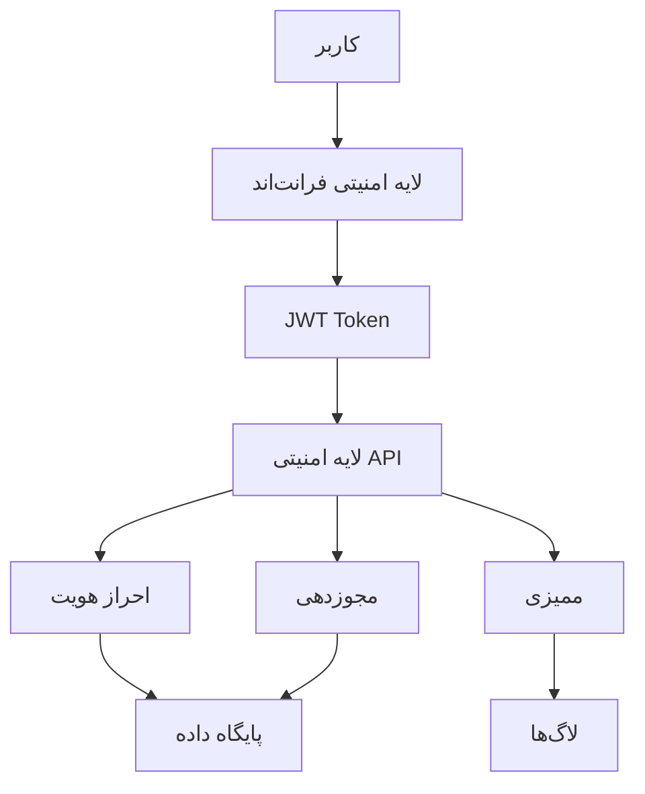

# استراتژی امنیتی

## معرفی
این سند استراتژی امنیتی سیستم را توصیف می‌کند. امنیت در تمام لایه‌های سیستم اعمال می‌شود و شامل احراز هویت، مجوزدهی، رمزنگاری و ممیزی است.

## معماری امنیتی



## لایه‌های امنیتی

### 1. احراز هویت
```typescript
interface AuthenticationService {
  // احراز هویت اولیه
  login(credentials: Credentials): Promise<AuthResult>;
  
  // تجدید توکن
  refreshToken(token: string): Promise<AuthResult>;
  
  // خروج
  logout(token: string): Promise<void>;
  
  // بررسی وضعیت
  validateSession(token: string): Promise<ValidationResult>;
}

interface AuthResult {
  accessToken: string;
  refreshToken: string;
  expiresIn: number;
  user: UserInfo;
}
```

### 2. مجوزدهی
```typescript
interface AuthorizationService {
  // بررسی دسترسی
  checkPermission(userId: string, resource: string, action: string): boolean;
  
  // بررسی نقش
  checkRole(userId: string, role: string): boolean;
  
  // دریافت دسترسی‌های کاربر
  getUserPermissions(userId: string): Permission[];
  
  // اعمال محدودیت
  applyRestrictions(userId: string, resource: any): any;
}
```

### 3. مدیریت نقش‌ها
```typescript
interface RoleManager {
  // تعریف نقش
  defineRole(role: RoleDefinition): void;
  
  // اختصاص نقش
  assignRole(userId: string, roleId: string): void;
  
  // حذف نقش
  removeRole(userId: string, roleId: string): void;
  
  // بروزرسانی مجوزها
  updatePermissions(roleId: string, permissions: Permission[]): void;
}

interface RoleDefinition {
  name: string;
  description: string;
  permissions: Permission[];
  restrictions?: ResourceRestriction[];
  metadata?: Record<string, any>;
}
```

## امنیت داده

### 1. رمزنگاری
```typescript
interface EncryptionService {
  // رمزنگاری داده
  encrypt(data: any, key: string): string;
  
  // رمزگشایی
  decrypt(encrypted: string, key: string): any;
  
  // هش کردن
  hash(data: string): string;
  
  // تولید کلید
  generateKey(length: number): string;
}
```

### 2. امنیت پایگاه داده
```sql
-- جدول کاربران با رمزنگاری
CREATE TABLE users (
    id              UUID PRIMARY KEY,
    username        VARCHAR(255) NOT NULL UNIQUE,
    password_hash   VARCHAR(255) NOT NULL,
    salt            VARCHAR(255) NOT NULL,
    last_login      TIMESTAMP,
    failed_attempts INTEGER DEFAULT 0,
    locked_until    TIMESTAMP,
    
    CONSTRAINT valid_username CHECK (length(username) >= 3)
);

-- جدول توکن‌ها
CREATE TABLE tokens (
    id              UUID PRIMARY KEY,
    user_id         UUID NOT NULL,
    token_hash      VARCHAR(255) NOT NULL,
    type            VARCHAR(50),
    expires_at      TIMESTAMP NOT NULL,
    created_at      TIMESTAMP DEFAULT CURRENT_TIMESTAMP,
    
    FOREIGN KEY (user_id) REFERENCES users(id) ON DELETE CASCADE
);

-- ایندکس‌های امنیتی
CREATE INDEX idx_tokens_hash ON tokens(token_hash);
CREATE INDEX idx_tokens_expiry ON tokens(expires_at);
```

### 3. امنیت API
```typescript
interface ApiSecurity {
  // اعتبارسنجی درخواست
  validateRequest(req: Request): ValidationResult;
  
  // محدودیت نرخ
  rateLimit(req: Request): boolean;
  
  // فیلتر محتوا
  sanitizeInput(data: any): any;
  
  // محافظت CSRF
  validateCsrfToken(token: string): boolean;
}
```

## ممیزی و لاگینگ

### 1. سیستم لاگ
```typescript
interface AuditLogger {
  // لاگ تغییرات
  logChange(
    userId: string,
    resource: string,
    action: string,
    changes: any
  ): void;
  
  // لاگ دسترسی
  logAccess(
    userId: string,
    resource: string,
    action: string,
    success: boolean
  ): void;
  
  // لاگ امنیتی
  logSecurity(
    type: SecurityEventType,
    details: any,
    severity: SeverityLevel
  ): void;
}

enum SecurityEventType {
  LOGIN_ATTEMPT,
  PASSWORD_CHANGE,
  PERMISSION_CHANGE,
  ROLE_CHANGE,
  DATA_ACCESS,
  CONFIGURATION_CHANGE
}
```

### 2. ردیابی تغییرات
```typescript
interface ChangeTracker {
  // ثبت تغییر
  trackChange(
    entity: string,
    entityId: string,
    changes: Record<string, any>
  ): void;
  
  // بازیابی تاریخچه
  getHistory(
    entity: string,
    entityId: string,
    options?: HistoryOptions
  ): Change[];
  
  // بازگشت به نسخه قبلی
  revert(changeId: string): Promise<void>;
}
```

## امنیت فرم‌ها

### 1. اعتبارسنجی داده‌ها
```typescript
interface FormSecurity {
  // اعتبارسنجی ورودی
  validateInput(
    formId: string,
    data: any,
    context: ValidationContext
  ): ValidationResult;
  
  // فیلتر داده‌های حساس
  sanitizeOutput(
    formId: string,
    data: any,
    userRole: string
  ): any;
  
  // محدودیت دسترسی فیلد
  restrictFields(
    formId: string,
    fields: string[],
    userRole: string
  ): string[];
}
```

### 2. امنیت فایل‌ها
```typescript
interface FileSecurityService {
  // اعتبارسنجی فایل
  validateFile(file: File, config: FileValidationConfig): boolean;
  
  // اسکن ویروس
  scanFile(file: File): Promise<ScanResult>;
  
  // رمزنگاری فایل
  encryptFile(file: File, key: string): Promise<EncryptedFile>;
  
  // محدودیت دسترسی
  setFilePermissions(fileId: string, permissions: FilePermission[]): void;
}
```

## پیکربندی امنیتی

### 1. تنظیمات امنیتی
```typescript
interface SecurityConfig {
  // تنظیمات توکن
  jwt: {
    secret: string;
    expiresIn: number;
    refreshExpiresIn: number;
  };
  
  // محدودیت‌های پسورد
  password: {
    minLength: number;
    requireNumbers: boolean;
    requireSymbols: boolean;
    requireUppercase: boolean;
    maxAge: number;
  };
  
  // محدودیت نرخ
  rateLimit: {
    window: number;
    max: number;
    blacklist: string[];
  };
  
  // CORS
  cors: {
    origins: string[];
    methods: string[];
    headers: string[];
  };
}
```

### 2. پیکربندی SSL/TLS
```typescript
interface TlsConfig {
  // گواهی‌نامه‌ها
  cert: {
    path: string;
    key: string;
    ca?: string[];
  };
  
  // تنظیمات
  options: {
    minVersion: string;
    ciphers: string[];
    honorCipherOrder: boolean;
  };
  
  // HSTS
  hsts: {
    maxAge: number;
    includeSubDomains: boolean;
    preload: boolean;
  };
}
```

## چک‌لیست امنیتی

### فاز 1: زیرساخت امنیتی
- [ ] پیکربندی SSL/TLS
- [ ] راه‌اندازی فایروال
- [ ] تنظیم CORS
- [ ] پیکربندی Rate Limiting

### فاز 2: احراز هویت و مجوزدهی
- [ ] پیاده‌سازی JWT
- [ ] سیستم مدیریت نقش‌ها
- [ ] کنترل دسترسی‌ها
- [ ] مدیریت نشست‌ها

### فاز 3: امنیت داده
- [ ] رمزنگاری داده‌های حساس
- [ ] امنیت پایگاه داده
- [ ] مدیریت کلیدها
- [ ] پشتیبان‌گیری امن

### فاز 4: ممیزی و نظارت
- [ ] سیستم لاگینگ
- [ ] هشدارها
- [ ] گزارش‌های امنیتی
- [ ] پایش مداوم

## نکات پیاده‌سازی

### 1. امنیت کد
- استفاده از کتابخانه‌های امن
- بررسی آسیب‌پذیری‌ها
- کدنویسی ایمن

### 2. تست امنیت
- تست نفوذ
- اسکن آسیب‌پذیری
- تست فازی

### 3. مستندسازی
- راهنمای امنیتی
- پروتکل‌های حادثه
- آموزش تیم 