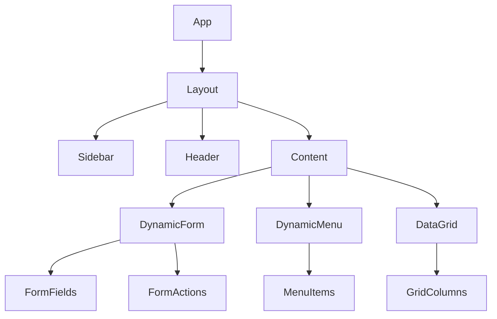

# کامپوننت‌های اصلی رابط کاربری

## معرفی
این سند کامپوننت‌های اصلی رابط کاربری سیستم را توصیف می‌کند. تمام کامپوننت‌ها با استفاده از React و TypeScript پیاده‌سازی شده‌اند و از Material-UI به عنوان کتابخانه پایه استفاده می‌کنند.

## ساختار کلی



## کامپوننت‌های پایه

### 1. Layout
```typescript
interface LayoutProps {
  // تنظیمات کلی
  config: LayoutConfig;
  // وضعیت منو
  sidebarOpen: boolean;
  // تم
  theme: ThemeConfig;
  // کامپوننت‌های اصلی
  header?: ReactNode;
  sidebar?: ReactNode;
  footer?: ReactNode;
  children: ReactNode;
}

interface LayoutConfig {
  // حالت نمایش
  mode: 'fixed' | 'fluid';
  // جهت
  direction: 'rtl' | 'ltr';
  // رسپانسیو
  breakpoints: {
    sidebar: number;
    content: number;
  };
}
```

### 2. DynamicForm
```typescript
interface DynamicFormProps {
  // تعریف فرم
  formDefinition: FormDefinition;
  // داده‌های اولیه
  initialData?: Record<string, any>;
  // حالت نمایش
  mode: 'create' | 'edit' | 'view';
  // اکشن‌ها
  onSubmit: (data: any) => Promise<void>;
  onCancel: () => void;
  // تنظیمات
  config: {
    showReset?: boolean;
    submitLabel?: string;
    cancelLabel?: string;
    layout?: FormLayout;
  };
}

interface FormLayout {
  // نوع چینش
  type: 'standard' | 'wizard' | 'tabs';
  // تنظیمات خاص هر نوع
  config: StandardLayout | WizardLayout | TabsLayout;
}
```

### 3. DynamicMenu
```typescript
interface DynamicMenuProps {
  // ساختار منو
  items: MenuItem[];
  // تنظیمات
  config: MenuConfig;
  // دسترسی‌ها
  permissions?: string[];
  // اکشن‌ها
  onItemClick: (item: MenuItem) => void;
}

interface MenuItem {
  id: string;
  title: string;
  icon?: string;
  type: MenuType;
  children?: MenuItem[];
  config?: Record<string, any>;
  permissions?: string[];
}
```

### 4. DataGrid
```typescript
interface DataGridProps {
  // داده‌ها
  data: any[];
  // تعریف ستون‌ها
  columns: ColumnDefinition[];
  // تنظیمات
  config: {
    pagination?: PaginationConfig;
    sorting?: SortingConfig;
    filtering?: FilterConfig;
    selection?: SelectionConfig;
  };
  // اکشن‌ها
  onRowClick?: (row: any) => void;
  onSelectionChange?: (selected: any[]) => void;
  toolbarActions?: ToolbarAction[];
}
```

## کامپوننت‌های فرم

### 1. فیلدهای پایه
```typescript
// کامپوننت پایه فیلد
interface BaseFieldProps {
  id: string;
  label: string;
  value: any;
  onChange: (value: any) => void;
  error?: string;
  disabled?: boolean;
  required?: boolean;
  helperText?: string;
}

// انواع فیلدها
interface TextFieldProps extends BaseFieldProps {
  type: 'text' | 'email' | 'password';
  maxLength?: number;
  pattern?: string;
}

interface SelectFieldProps extends BaseFieldProps {
  options: SelectOption[];
  multiple?: boolean;
  searchable?: boolean;
}

interface DateFieldProps extends BaseFieldProps {
  format?: string;
  minDate?: Date;
  maxDate?: Date;
  disabledDates?: Date[];
}
```

### 2. فیلدهای پیشرفته
```typescript
// فیلد رابطه‌ای
interface RelationFieldProps extends BaseFieldProps {
  relatedForm: string;
  displayFields: string[];
  searchFields: string[];
  multiple?: boolean;
  filters?: FilterCondition[];
}

// فیلد محاسباتی
interface CalculatedFieldProps extends BaseFieldProps {
  formula: string;
  dependencies: string[];
  format?: string;
}

// فیلد آپلود
interface FileUploadProps extends BaseFieldProps {
  accept: string[];
  maxSize: number;
  multiple?: boolean;
  preview?: boolean;
}
```

### 3. اعتبارسنجی
```typescript
interface ValidationProps {
  // قوانین پایه
  required?: boolean;
  min?: number;
  max?: number;
  pattern?: string;
  
  // قوانین پیشرفته
  custom?: (value: any) => string | null;
  async?: (value: any) => Promise<string | null>;
  
  // وابستگی‌ها
  dependencies?: {
    fields: string[];
    rule: (values: Record<string, any>) => string | null;
  };
}
```

## کامپوننت‌های منو

### 1. ساختار منو
```typescript
interface MenuStructureProps {
  // آیتم‌های منو
  items: MenuItem[];
  // حالت نمایش
  mode: 'sidebar' | 'horizontal' | 'dropdown';
  // تنظیمات
  config: {
    expandable?: boolean;
    iconPosition?: 'left' | 'right';
    showBadges?: boolean;
  };
}
```

### 2. آیتم منو
```typescript
interface MenuItemComponentProps {
  // داده‌های آیتم
  item: MenuItem;
  // سطح
  level: number;
  // وضعیت
  expanded?: boolean;
  active?: boolean;
  // اکشن‌ها
  onClick: () => void;
  onExpand?: () => void;
}
```

## استایل‌دهی و تم

### 1. سیستم تم
```typescript
interface ThemeConfig {
  // رنگ‌ها
  colors: {
    primary: string;
    secondary: string;
    background: string;
    surface: string;
    text: string;
    error: string;
  };
  
  // تایپوگرافی
  typography: {
    fontFamily: string;
    fontSize: Record<string, string>;
    fontWeight: Record<string, number>;
  };
  
  // فاصله‌گذاری
  spacing: Record<string, string>;
  
  // سایه‌ها
  shadows: Record<string, string>;
  
  // انیمیشن‌ها
  transitions: {
    duration: Record<string, number>;
    easing: Record<string, string>;
  };
}
```

### 2. استایل‌های پایه
```typescript
const baseStyles = {
  // کارت‌ها
  card: {
    borderRadius: '8px',
    padding: '16px',
    boxShadow: '0 2px 4px rgba(0,0,0,0.1)'
  },
  
  // دکمه‌ها
  button: {
    borderRadius: '4px',
    padding: '8px 16px',
    transition: 'all 0.2s ease'
  },
  
  // فرم‌ها
  form: {
    gap: '16px',
    maxWidth: '800px',
    margin: 'auto'
  }
};
```

## انیمیشن‌ها

### 1. انیمیشن‌های پایه
```typescript
const animations = {
  // فید
  fade: {
    enter: {
      opacity: 0,
      transform: 'scale(0.95)'
    },
    enterActive: {
      opacity: 1,
      transform: 'scale(1)',
      transition: 'all 200ms ease'
    },
    exit: {
      opacity: 1,
      transform: 'scale(1)'
    },
    exitActive: {
      opacity: 0,
      transform: 'scale(0.95)',
      transition: 'all 200ms ease'
    }
  },
  
  // اسلاید
  slide: {
    enter: {
      transform: 'translateX(-100%)'
    },
    enterActive: {
      transform: 'translateX(0)',
      transition: 'transform 300ms ease'
    },
    exit: {
      transform: 'translateX(0)'
    },
    exitActive: {
      transform: 'translateX(100%)',
      transition: 'transform 300ms ease'
    }
  }
};
```

## مدیریت وضعیت

### 1. هوک‌های سفارشی
```typescript
// مدیریت فرم
function useFormState(formId: string) {
  const [data, setData] = useState({});
  const [errors, setErrors] = useState({});
  const [dirty, setDirty] = useState(false);
  
  // متدهای مدیریت داده
  const updateField = (field: string, value: any) => {};
  const validate = () => {};
  const reset = () => {};
  
  return { data, errors, dirty, updateField, validate, reset };
}

// مدیریت منو
function useMenuState() {
  const [expanded, setExpanded] = useState<string[]>([]);
  const [active, setActive] = useState<string | null>(null);
  
  // متدهای مدیریت وضعیت
  const toggleExpand = (id: string) => {};
  const setActiveItem = (id: string) => {};
  
  return { expanded, active, toggleExpand, setActiveItem };
}
```

### 2. مدیریت کش
```typescript
function useCachedData(key: string, fetcher: () => Promise<any>) {
  const [data, setData] = useState(null);
  const [loading, setLoading] = useState(false);
  
  // متدهای مدیریت کش
  const refresh = async () => {};
  const invalidate = () => {};
  
  return { data, loading, refresh, invalidate };
}
```

## چک‌لیست پیاده‌سازی

### فاز 1: کامپوننت‌های پایه
- [ ] پیاده‌سازی Layout
- [ ] کامپوننت‌های فرم پایه
- [ ] سیستم تم
- [ ] انیمیشن‌های پایه

### فاز 2: فرم‌ساز
- [ ] کامپوننت DynamicForm
- [ ] انواع فیلدها
- [ ] اعتبارسنجی
- [ ] ذخیره وضعیت

### فاز 3: سیستم منو
- [ ] کامپوننت DynamicMenu
- [ ] مدیریت وضعیت منو
- [ ] انیمیشن‌های منو
- [ ] دسترسی‌ها

### فاز 4: بهینه‌سازی
- [ ] کش‌گذاری
- [ ] لود تنبل
- [ ] بهینه‌سازی رندر
- [ ] تست‌های عملکرد

## نکات پیاده‌سازی

### 1. عملکرد
- استفاده از React.memo
- بهینه‌سازی رندر مجدد
- کش‌گذاری داده‌ها

### 2. دسترسی‌پذیری
- پشتیبانی از کیبورد
- ARIA labels
- رنگ‌های مناسب

### 3. تست‌پذیری
- تست‌های واحد
- تست‌های یکپارچگی
- تست‌های عملکرد 